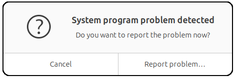

# zark
**The Zettabyte Ark - Full bare-metal ZFS recovery with encrypted boot**

*A Noah's Ark for ZFS-on-root Ubuntu: when the disaster comes, your system makes it across.*

[](https://github.com/juanmitaboada/zark/actions/workflows/ci.yml) [](https://launchpad.net/~juanmitaboada/+archive/ubuntu/zark) [](https://github.com/juanmitaboada/zark/releases/latest) [](https://opensource.org/license/apache-2.0) [](https://www.python.org/downloads/) [](https://ubuntu.com/download) [](CHANGELOG.md)

zark is a portable Python-based suite for backing up and fully recovering Ubuntu systems running ZFS with full-disk encryption. It runs from any location - USB drive, live session, or local directory - with zero installation required.

One command to back up. One command to recover. Boot chain identical to a fresh Ubuntu install.

> **Project status.** Active development. Recovery flow validated end-to-end on real hardware (MINISFORUM UM890 with Ubuntu 24.04 + 25.10 + 26.04 and Dell XPS 9315 with Ubuntu 25.10) and in a QEMU/OVMF integration harness simulating both Ubuntu 24.04 (initramfs-tools) and 25.04+ (dracut). Backup and recover have also been used in anger to restore a separate Ubuntu 25.10 system after disk failure. Suite version is tracked in [`CHANGELOG.md`](CHANGELOG.md).

---

## ⚠️ Warning

zark performs **destructive operations** on ZFS pools and disk devices, including pool destruction, dataset rollback, partition table rewriting, and boot chain modification.

- **You can lose all data** on the target drives if you misidentify a device.
- **You can render your system unbootable** if recovery is interrupted or misconfigured.
- Always test on **non-production hardware** first.
- Always keep **at least one independent backup** outside of zark's control.
- The authors assume no responsibility for data loss, hardware damage, or system downtime resulting from the use of this tool.

This software is provided "as is", without warranty of any kind, as detailed in the [Apache License 2.0](LICENSE).

---

## Why zark?

Recovering a ZFS-on-root Ubuntu system with full-disk encryption is notoriously difficult. The boot chain involves GRUB, EFI, initramfs/dracut, encrypted datasets, keystore volumes, and Secure Boot - all tightly coupled. A single misstep leaves you at an emergency shell with no clear path forward.

zark automates the entire process:

- **Full bare-metal recovery in ~1 minute** - from backup drive to bootable system, including encrypted datasets, boot pool, keystore, and EFI partition.
- **100% standard Ubuntu boot chain** - no custom binaries, no patched configs. The recovered system is indistinguishable from a fresh install and survives `apt upgrade` indefinitely.
- **Secure Boot compliant** - proper signed GRUB chain (shimx64 → grubx64 signed by Canonical), never just `grub-install`.
- **Portable, zero install** - the entire suite lives in a single directory. Copy it to a USB drive and carry your disaster recovery in your pocket.
- **Full-disk encryption throughout** - raw `zfs send` preserves encryption natively. Keys never touch disk in cleartext during transfer.

---

## Commands

| Command            | Description                                                  |
|--------------------|--------------------------------------------------------------|
| `explore`          | Scan for ZFS pools, show known/unknown drives                |
| `setup`            | Install dependencies, configure sanoid for automatic snapshots |
| `prepare`          | Initialize a new blank drive as a backup target              |
| `backup`           | Incremental encrypted backup via syncoid raw send            |
| `recover`          | Full bare-metal system recovery from backup                  |
| `finish`           | Post-recovery finalization (run from the recovered system)   |
| `repair-boot`      | Fix boot issues from a live USB without full recovery        |
| `repair-divergent` | Reset backup datasets that diverged from the source          |
| `chroot`           | Open an interactive chroot into the installed system (live USB) |
| `mount`            | Mount a backup pool — or the local system (`mount local`) — for inspection/chroot |
| `umount`           | Unmount a backup pool, or the local system (`umount local`)  |
| `clean`            | Emergency cleanup: unmount everything, export all pools      |
| `purge`            | Securely wipe a managed backup drive                         |
| `monitor`          | Live progress monitor (run in a separate terminal)           |
| `simulate`         | Boot the target disk in QEMU/KVM to verify the boot chain    |
| `health`           | Non-destructive risk checks on a backup drive                |

---

## Installation

zark ships in three complementary forms; **all three are first-class** and serve different use cases.

### Apt via PPA (recommended for productive systems)

For machines where zark drives the day-to-day backup routine:

```bash
sudo add-apt-repository ppa:juanmitaboada/zark
sudo apt update
sudo apt install zark
```

Supported series: noble (24.04 LTS), questing (25.10), resolute (26.04 LTS). The package installs zark under `/usr/share/zark/`, exposes it as `/usr/bin/zark`,
and creates `/etc/zark/` for `known_drives.json`. Logs go to `/var/log/zark.log`.

### Standalone .deb download (when PPA isn't an option)

If you cannot or prefer not to add a PPA — restricted networks, offline systems, or simply a one-shot install — every release ships a prebuilt `.deb` as a release asset on GitHub:

```bash
wget https://github.com/juanmitaboada/zark/releases/latest/download/zark_<VERSION>-1_all.deb
sudo apt install ./zark_*.deb
```

Same package, same layout as the PPA install — only the delivery channel differs. Updates are manual: re-download when a new release is announced.

### Portable tarball (required for live-USB recovery)

For disaster recovery from a live USB — when there is no installed system to `apt install` into — head to the [**Releases page**](https://github.com/juanmitaboada/zark/releases/latest) and
download the `zark_X.Y.Z.tar.gz` asset attached to the latest release. Then:

```bash
tar xzf zark_*.tar.gz
cd zark
sudo ./zark explore
```

The tarball runs from any directory (USB pendrive, `/opt`, `~/bin`) without installation. When zark detects it is running on a live USB session, it logs
to `<zark_root>/zark.log` next to the script (which survives reboot, since the pendrive does) instead of `/var/log/`.

> **Why three?** The `.deb` package (PPA or direct) cannot help during recovery because the live USB does not have zark installed and you cannot `apt install`
> in a casper environment. The portable tarball is the only path for the recover command. The PPA is the most ergonomic for routine backups (apt updates handle versioning), and the standalone `.deb` covers air-gapped or offline deployments where the PPA channel is impractical.

## Quick start

### First-time setup

Once per machine — installs sanoid for automatic snapshots and registers your backup drive:

```bash
sudo ./zark setup     # install sanoid + zfs tooling, configure snapshots
sudo ./zark prepare   # initialize a blank drive as a backup target
```

`prepare` creates the backup pool, registers the drive's GUID in `etc/known_drives.json`, and runs the first sync. After this, `zark backup` finds the drive automatically every time you connect it.

### Back up your system

```bash
# Connect your backup drive, then:
sudo ./zark backup

# Or skip the snapshot pass (e.g. re-run after a transient failure):
sudo ./zark backup --no-snapshot
```

zark detects the backup drive by GUID, takes a fresh `sanoid` snapshot pass on the source pool, and replicates all datasets via encrypted raw send. A typical incremental backup takes seconds.

### Recover from scratch

Boot from an Ubuntu live USB with the backup drive connected:

```bash
sudo ./zark recover
```

zark will:
1. Detect the internal disk and backup drive
2. Partition the internal disk (GPT + EFI + bpool + rpool)
3. Create the ZFS pools with encryption enabled
4. Restore all datasets from the most recent snapshot
5. Restore the boot pool, keystore, and EFI binaries
6. Install the GRUB guard and regenerate initrd
7. Display post-recovery instructions

Total recovery time: approximately one minute, plus the data transfer time itself.

### After first boot

Once the recovered system boots successfully:

```bash
sudo ./zark finish    # regenerate grub.cfg, finalize Secure Boot chain
```

`finish` is idempotent and safe to re-run. It runs `update-grub` internally, so you don't need to invoke it separately.

### Fix a broken boot by hand (chroot)

When the pools are intact but the boot chain is broken — and you want to run a few commands inside the real system rather than a full `recover` — drop into a chroot from a live USB:

```bash
sudo ./zark chroot          # imports rpool/bpool, unlocks, mounts, chroots in
# inside the chroot, work as if booted:
update-grub
dpkg-reconfigure grub-efi-amd64-signed
exit                        # zark unmounts and exports both pools cleanly
```

For a quick look at the installed disk without a working shell, `sudo ./zark mount local` mounts it read-only (and `sudo ./zark umount local` releases it). `repair-boot` remains the one-shot, non-interactive option for the common grub-regeneration case.

### Test the recovered boot without rebooting

```bash
sudo ./zark simulate                          # boot the internal disk in QEMU (read-only by default)
sudo ./zark simulate --display 1920x1080      # override the default 2560×1440 resolution
```

Useful as a coherence check after `recover` (or any boot-chain change) without committing to a real reboot. By default, QEMU is started with `-snapshot` so any writes are discarded at shutdown and the underlying disk is never modified. Pass `--rw` (with explicit confirmation) if you actually want changes to persist.

---

## Architecture

```
zark/
├── zark                 # Entry point (#!/usr/bin/env python3)
├── lib/
│   ├── config.py        # Centralized version and configuration
│   ├── log.py           # Colored output, banners, logging
│   ├── sh.py            # Shell command runner with logging
│   ├── zfs.py           # ZFS/zpool operations
│   ├── keystore.py      # Encryption key management
│   ├── drives.py        # Drive detection and GUID verification
│   ├── mount.py         # Mount/unmount orchestration
│   ├── repair.py        # Divergence detection (shared by backup + repair-divergent)
│   └── cleanup.py       # Trap handler, safe teardown
├── commands/
│   ├── backup.py            # Incremental encrypted backup
│   ├── recover.py           # Full bare-metal recovery
│   ├── repair_boot.py       # Boot chain repair from live USB
│   ├── repair_divergent.py  # Reset diverged backup datasets (interactive)
│   ├── finish.py            # Post-recovery finalization
│   ├── explore.py           # Pool and drive scanner
│   ├── setup.py             # Dependency installation, Secure Boot pre-check
│   ├── prepare.py           # New drive initialization
│   ├── mount.py             # Backup pool mounting (+ `mount local` for the system)
│   ├── umount.py            # Backup pool unmounting (+ `umount local`)
│   ├── chroot.py            # Interactive chroot into the installed system (live USB)
│   ├── clean.py             # Emergency cleanup
│   ├── purge.py             # Secure drive wipe
│   ├── monitor.py           # Live progress display
│   └── simulate.py          # QEMU boot test (read-only by default)
└── etc/
    └── known_drives.json  # Registered backup drives (by GUID)
```

---

## Key design decisions

### Why raw `zfs send` instead of file-level backup?

Block-level replication via `zfs send -w` (raw/encrypted) is fundamentally different from file-level tools like rsync:

- **Atomic snapshots** - the backup represents an exact point-in-time state, created in milliseconds without interrupting running services.
- **Encryption preserved** - raw send transmits encrypted blocks directly. The backup drive holds ciphertext; keys are never exposed during transfer.
- **Efficiency** - incremental sends only transmit changed blocks since the last snapshot, regardless of file count or size.

### Why not just use syncoid directly?

zark uses syncoid (from sanoid) as its replication engine, but adds everything syncoid doesn't handle: drive detection, pool creation with correct encryption parameters, boot pool management, keystore restoration, GRUB/EFI chain repair, dracut/initramfs hook installation, Secure Boot compliance, and safe cleanup on failure.

### The GRUB guard

When an external ZFS backup pool is connected, Ubuntu's `10_linux_zfs` GRUB script auto-imports all visible pools and attempts to mount their encrypted datasets. When this fails (no key loaded), it generates a `grub.cfg` with zero kernel entries - an unbootable system.

zark installs `09_zfs_backup_guard`, a lightweight script that detects external pools and blocks `update-grub` with a clear error message before any damage occurs.

### The apt guard

The GRUB guard fires late: it can refuse to regenerate `grub.cfg`, but by then a kernel package upgrade has already unpacked the new kernel into `/boot` and autoremove may have pulled the old one — leaving a `grub.cfg` that points at a kernel which no longer exists. This is exactly how a background `unattended-upgrades` run, with a backup drive still connected, can brick a system.

To close that vector, `setup` (on the running system) and `recover`/`finish` (on a recovered system) install an apt guard: a standalone `/usr/local/lib/zark/apt-zfs-backup-guard` script wired in as a `DPkg::Pre-Install-Pkgs` hook. APT runs it *before* dpkg unpacks anything; when a boot-critical package (`linux-image-*`, `linux-headers-*`, `grub-*`, `shim-*`, `zfs-*`) is being installed while an external ZFS pool is connected, the hook aborts the entire transaction. It detects pools with `zpool` directly — no dependency on zark itself — so it keeps protecting a recovered system after the live USB is gone. zark's own recovery flows set `ZARK_INTERNAL=1` to bypass it; a login-time MOTD reminder (`/etc/update-motd.d/99-zark-external-pool`) warns when an external pool is attached.

### Boot chain integrity

zark never calls `grub-install` alone. The correct Secure Boot procedure is:

1. `grub-install` - installs GRUB modules and bootstrap
2. `dpkg-reconfigure grub-efi-amd64-signed` - overwrites with Canonical-signed binary
3. `dpkg-reconfigure shim-signed` - ensures shim chain is intact
4. `update-grub` - regenerates grub.cfg

This produces a boot chain identical to a fresh Ubuntu installation.

---

## Compatibility

- **Ubuntu 24.04 LTS** — uses initramfs-tools hooks for keystore unlock.
- **Ubuntu 25.04 / 25.10** — uses dracut module (89keystore) with systemd-ask-password integration. zark detects which generator the system has at recovery time.
- **Ubuntu 26.04 LTS** — same dracut path as 25.04+, plus shim 15.8 (`.signed.latest`) pinning during recovery to avoid the SBAT revocation that affects fresh subiquity installs left pointing at `.signed.previous`.
- **Cross-host recovery** — backups are portable across machines: a backup taken on machine A can be restored onto machine B with a different drive layout / firmware. zark rewrites every `--fs-uuid` reference in `grub.cfg` (including those carrying `--hint-bios` / `--hint-efi` / `--hint-baremetal` options) so the recovered system boots regardless of where its disks land in the new BIOS enumeration.
- **ZFS encryption** — AES-256-GCM with `keyformat=raw`, encryption key on a LUKS-encrypted zvol (the keystore).
- **bpool features** — restricted to the GRUB-readable subset documented in `/usr/share/zfs/compatibility.d/grub2`. zark explicitly does not enable `head_errlog` or `vdev_zaps_v2` on bpool: even GRUB 2.14 (Ubuntu 26.04) cannot read either, and activating them produces an unbootable system. rpool is unaffected and uses whatever features the running ZFS supports.
- **Secure Boot** — full compliance via signed GRUB chain (shimx64 → grubx64.signed → kernel).
- **Hardware tested:**
  - MINISFORUM UM890 (Ubuntu 24.04 + 25.10 + 26.04) — primary development system.
  - Dell XPS 9315 with NVMe (Ubuntu 25.10) — secondary, used for cross-host validation against the MINISFORUM.
  - Disk-failure recovery on a separate Ubuntu 24.04 system, restoring from a syncoid backup.
- **CI/test:** end-to-end QEMU/OVMF integration harness validates Phase 1 (create + backup), Phase 2 (recover), and Phase 3 (boot the recovered disk).

---

## Requirements

- Ubuntu live USB (for recovery operations)
- Python 3 (included in Ubuntu live environment)
- ZFS utilities (`zfsutils-linux`, included in Ubuntu desktop)
- sanoid/syncoid (installed automatically by `zark setup`)
- An external drive for backup storage

---

## Configuration: `known_drives.json`

Registered backup drives live in `known_drives.json` (under `/etc/zark/` on a system install, or `etc/` in a portable checkout; overridable with `ZARK_CONFIG_DIR`). Each top-level key is a pool name; `prepare` creates entries automatically, but you can edit the file by hand. Fields per drive:

| Field            | Type    | Required | Meaning |
|------------------|---------|----------|---------|
| `guid`           | string  | yes      | The pool GUID (decimal). zark matches the connected drive by this. |
| `drive_id`       | string  | yes      | The stable `/dev/disk/by-id/` identifier (model + serial), without the `-part1` suffix. zark imports the pool by this exact device. |
| `last_backup_at` | string  | no       | ISO-8601 UTC of the last successful backup; auto-written by `zark backup`. Drives the staleness reporting. |
| `autoeject`      | boolean | no       | When `true`, the eject prompt for this drive shows a 10-second countdown and then applies the command's default automatically (any keypress cancels it and lets you answer by hand). Useful for unattended rotation. Absent or `false` (the default) means the prompt waits for you indefinitely, as it always has. `prepare` asks whether to enable this; you can also toggle it by editing the file. |

Example:

```json
{
  "backup": {
    "guid": "8963688414852777737",
    "drive_id": "usb-Vendor_Model_SERIAL-0:0",
    "last_backup_at": "2026-06-04T04:23:42Z",
    "autoeject": true
  },
  "black": {
    "guid": "14361060171807873218",
    "drive_id": "usb-Vendor_Model_OTHERSERIAL-0:0"
  }
}
```

## Drive rotation and retention policy

zark supports rotating multiple backup drives — one at home, one off-site, an archival copy in a desk drawer — and the way snapshot retention is configured determines how long a drive can stay disconnected before its next backup will fail.

### How divergence happens

When `zark backup` runs, `syncoid` finds the most recent snapshot present on **both** the source pool (`rpool`) and the target backup drive, and replicates the delta from that anchor forwards. If the source's `sanoid` retention has purged every snapshot the target still holds, there is no anchor — `syncoid` aborts with `Cowardly refusing to destroy your existing target`. Container datasets (`rpool`, `rpool/ROOT`, `rpool/var`, `bpool`) are most exposed because they barely change and accumulate fewer snapshots than active leaves like `rpool/USERDATA`.

### Retention windows

`zark setup` writes two sanoid templates to `/etc/sanoid/sanoid.conf`:

| Template | Datasets | Retention |
|---|---|---|
| `template_production` | `rpool/ROOT/<ubuntu>`, `rpool/USERDATA`, `bpool/BOOT` | hourly=24, daily=7, weekly=4, monthly=3 |
| `template_minimal` | `rpool`, `rpool/ROOT`, `rpool/var`, `bpool`, anything new | daily=14, weekly=8, monthly=3 |

Both give a worst-case overlap window of **roughly three months** before snapshots rotate out and the drive starts diverging. `template_minimal` was tightened from the original `daily=2` (no weekly or monthly) precisely because the old values made any drive disconnected for more than two days diverge on every container dataset.

### Drive staleness reporting

To help spot a forgotten drive before it crosses the divergence cliff, `zark backup` records a `last_backup_at` timestamp in `etc/known_drives.json` after every successful run. Reporting is purely informative — `zark backup` does not refuse to run on a drive that has not been backed up in a long time. The actual divergence threshold depends on sanoid's retention (which the operator can change), and a backup that has crossed it may still succeed if some shared snapshot remains. When syncoid does abort, the existing divergence handling in `repair-divergent` already takes over.

The retention horizon is read at runtime from `/etc/sanoid/sanoid.conf` and computed as `max(daily, weekly*7, monthly*30)` over the templates actually used by `[rpool*]`/`[bpool*]` sections. After a successful backup, two informative messages may appear after the **BACKUP COMPLETED** banner:

1. If the selected drive was already past the retention horizon when this run started, a **WARN** explains the situation and points at `zark purge` followed by `zark prepare` as the only remediation that fully reinitializes a drive that has aged past its anchor. The message also notes explicitly that `zark repair-divergent` does **not** fix staleness — it only fixes divergent datasets after a syncoid abort.
2. An **INFO** list shows other known drives whose age has reached the danger zone (`>= retention - 30` days), so the operator knows which drive to grab next without running another command.

The same staleness note is shown by `zark repair-divergent` when no divergent datasets are found but the selected drive is in the danger zone — an operator who came expecting a fix is told why this command can't help.

### `--no-sync-snap` for syncoid

`zark backup` invokes `syncoid` with `--no-sync-snap` for both `rpool` and `bpool` transfers. Without the flag, syncoid creates `@syncoid_<host>_<ts>` snapshots before each transfer and cleans up older ones afterwards via `pruneoldsyncsnaps` — but with multiple backup drives, this cleanup destroys the source snapshot that the *other* drive still uses as its anchor, producing a long cascade of "could not find any snapshots to destroy / WARNING: zfs destroy ... failed: 256" warnings on every other run. With `--no-sync-snap`, syncoid uses the most recent existing snapshot in source as the anchor (the `autosnap_*` snapshots that step 6 of `zark backup` takes via `sanoid --take-snapshots`), and the cascade is gone at its source.

### `zark repair-divergent`

When divergence happens despite the retention windows, `repair-divergent` walks every divergent dataset, shows size, snapshot dates, the last shared snapshot with the source, and child datasets summary, and asks per dataset whether to destroy, skip, or abort the run. Datasets above 1 GiB require typing the literal string `DESTROY` (case-sensitive) at a second prompt before being touched. The threshold is hardcoded — there is no `--yes` or `--force` flag.

---

## Safe USB disconnect

ZFS issues writes with FUA (Force Unit Access) on critical metadata — uberblocks and the four redundant pool labels — meaning "do not acknowledge until this byte is on persistent media, not in volatile cache." Many cheap USB-SATA bridge chipsets ignore FUA and acknowledge from internal DRAM. ZFS believes the write is committed and `zpool export` reports success while the bridge still holds dirty pages; if the operator unplugs at that moment the kernel emits a last-ditch `SYNCHRONIZE CACHE` over the disconnecting cable, it fails with `DID_ERROR`, and the pending writes — possibly including the labels — are lost. Result: the pool comes back **FAULTED** on next import with `failed to unpack label 0/1/2/3`. Unrecoverable; not even `zpool import -FX` brings it back.

zark protects against this in two layers at every point where a command finishes with a pool exported:

1. **`sync(2)` + 2-second pause** — pushes the kernel page cache and dirty block-device buffers to the device, then gives the bridge firmware time to drain its internal queue. Always runs, no prompt.
2. **Interactive `eject` prompt** — `eject(1)` issues SCSI `SYNCHRONIZE CACHE (0x35)` followed by `START STOP UNIT (stop=1)`. SYNCHRONIZE CACHE is the device's most authoritative flush primitive (the bridge sees it as a distinguished operation, distinct from inline FUA — most chipsets that cheat on FUA still honour it). STOP UNIT then powers the controller down.

The eject is **never automatic**. After the success banner, zark asks:

```
Eject drive 'backup' now? (powers the device down) [Y/n]:
```

with a command-specific default chosen to match the typical next step:

| Command            | Default eject | Why |
|--------------------|---------------|-----|
| `backup`           | yes           | Typical: done backing up, unplug. |
| `umount`           | yes           | Operator signalled intent to disconnect by running `umount`. |
| `purge`            | yes           | Drive is being retired or repurposed. |
| `recover`          | yes           | Next step is unplug + reboot. |
| `prepare`          | no            | Canonical follow-up is `backup` against the same drive. |
| `repair-divergent` | no            | Canonical follow-up is `backup` to validate the fix. |
| `repair-boot`      | n/a           | No removable drive involved; no prompt. |

If the prompt is answered without input (script, cron, systemd timer), the default applies. There is no `--eject` / `--no-eject` flag — the prompt with a sensible default is the only knob.

zark then emits one of two banners depending on the answer:

```
╔══════════════════════════════════════════════════════════╗
║  💾  Safe to unplug drive 'backup'                       ║      ← after eject
╚══════════════════════════════════════════════════════════╝

╔══════════════════════════════════════════════════════════╗
║  🔌  Drive 'backup' flushed, still attached              ║      ← after declining eject
╚══════════════════════════════════════════════════════════╝
```

The colours and icons are deliberately disjoint so the two states are never confused.

**Side-effect of STOP UNIT**: after a successful eject the drive **disappears from `/dev`** until physically replugged. This is intentional and lines up with the workflow. If a follow-up command on the same drive is planned, answer `n` and the drive stays in `/dev` — the kernel-side flush has still run, so a clean `umount` or another zark command later will prompt again.

`repair-boot` does not prompt: it touches only the internal rpool/bpool on the system disk, never a removable drive, and refuses to run with external pools imported.

### Read-back verification

A clean `zpool export` is not proof that the pool survived. The same FUA-lying bridges can also lose **spacemaps** while the labels persist, so the pool scans as `ONLINE` but fails a real open deep in `vdev_load` with `metaslab_init failed [error=52]` — discovered only when you finally need the backup. To catch this immediately, `backup` re-imports the pool **read-only** after export (dropping the page cache first so the read comes from the device, not RAM) and requires `ONLINE` before declaring the backup safe. If the re-import fails it prints **`BACKUP NOT VERIFIED`** and stops short of the safe-to-unplug prompt: the data is not trustworthy even though `syncoid` and `export` reported success. This is always on.

### Known-bad enclosures and the UAS quirk

The bridge chipsets that cause all of the above are documented, with their USB IDs, exact kernel signatures, and the system-level `usb-storage` quirk that forces the conservative transport, in [**`docs/HARDWARE.md`**](docs/HARDWARE.md). If you hit `BACKUP NOT VERIFIED`, an import that fails with `insufficient replicas` on a healthy-looking drive, or `Synchronize Cache(10) failed: DID_ERROR` under load, read that first.

To check a drive's risk factors up front without writing anything, run `zark health [/dev/sdX]`. It is fully interactive: it asks whether you want a read-only check (default) or a destructive write-and-verify test, gathers any further choices, then runs unattended. The read-only check inspects the bridge's reported cache semantics, the active USB transport (UAS vs usb-storage), and the bridge model against a known-problematic list. The destructive test creates a throwaway pool, writes with transaction churn (fast ~2 GB, medium ~15 GB, or whole-disk "surface"), and re-imports to confirm the bridge actually persisted the data; an optional cold pass powers the device down and has you physically reconnect it before re-importing, so the read-back comes strictly from NAND. `prepare` runs the same read-only check before doing any work and asks for confirmation if a risk factor is present. Whenever a risk or test failure is found, a diagnostic report is written to `/tmp` with instructions for filing a GitHub issue. Note that a non-destructive check can only flag *risk* — it cannot prove a bridge is honest, since that only shows under write load. The authoritative proof is the read-back that `prepare`, `backup`, and the destructive test perform after writing.

---

## Testing

zark has two layers of automated testing.

### Unit tests

Pure Python, no root, no ZFS, no real disks. Every shell call is intercepted by a mock framework (`tests/mock_sh.py`).

```bash
make test       # fast path: invokes the test runner directly
make tox        # full path: runs the suite under Python 3.12, 3.13 and 3.14
```

Currently 147 tests covering config loading, drive detection, ZFS operations, keystore handling, the recovery abort path when a keystore is missing from backup, dataset-layout drift detection, grub.cfg manipulation including cross-host UUID rewriting, the syncoid version-detection helper, and the cleanup trap handler.

GitHub Actions runs the unit-test suite on every push and pull request, with one job per supported Python version plus a separate lint job (mypy + pylint + ruff). See `.github/workflows/ci.yml`.

### Integration tests (QEMU)

End-to-end test that creates a real encrypted ZFS Ubuntu system inside QEMU, backs it up, recovers to a second virtual disk, and boots the recovered disk to verify the full chain. Requires KVM and an Ubuntu live ISO.

```bash
make test-deps                                # one-time: qemu, ovmf, genisoimage
sudo make test-real ISO=/path/to/ubuntu.iso   # full run (all 3 phases)
```

**Integration tests do not run in GitHub Actions.** GitHub-hosted runners lack nested KVM, the recovery flow needs root and the ZFS kernel modules, and the full run takes ~15 minutes per phase. They are intended for local validation on real hardware (or a workstation with KVM enabled) before tagging a release.

The harness can also run individual phases — useful while iterating on a single phase without re-creating earlier artifacts:

```bash
sudo make test-phase1 ISO=/path/to/ubuntu.iso  # create test system + backup
sudo make test-phase2 ISO=/path/to/ubuntu.iso  # recover to target disk
sudo make test-phase3                          # boot the recovered disk
sudo make test-cleanup                         # remove all test artifacts
```

See `tests/test_integration.py` for harness internals and `tests/create_test_system.sh` for the synthetic-system fixture.

### Static analysis

```bash
make check        # py_compile every .py file (fast, no dependencies)
make mypy         # type-check with mypy (fails on any error)
make pylint       # run pylint
make lint         # check + mypy + pylint
make format       # black + isort
make pre-commit   # run every pre-commit hook against every tracked file
```

Tool configuration lives in `pyproject.toml` (mypy, pyright, black, isort, flake8) and `.pylintrc` (pylint, kept separate due to size). Pre-commit hooks are wired in `.pre-commit-config.yaml`.

---

## Troubleshooting

### "System program problem detected" popup



Symptom: while running zark from the Ubuntu live USB, a small dialog appears with a question mark icon, the title `System program problem detected`, the question `Do you want to report the problem now?`, and two buttons: `Cancel` and `Report problem...`.

Cause: this is **Apport**, Ubuntu's automatic crash-reporting agent. The popup is unrelated to zark — it's triggered when an unrelated background process on the live USB (typically `udisks2`, `systemd-udevd`, or one of the GNOME volume monitors) gets confused by the rapid disk activity zark performs (`zpool create`, `wipefs`, `sgdisk`, repeated mount/unmount cycles). Apport flags this as a system anomaly and asks the user whether to send a report to Canonical. **It does not mean zark has failed.** zark prints its own errors clearly in the terminal where you ran it, prefixed with `[FATAL]` or `[WARN]`.

What to do: the safest action is to **ignore the popup, send it to the background, and keep working in the terminal**. Don't click `Report problem...` (it tries to launch a web browser to upload the crash, which on a live USB without configured network can hang things further) and don't force-close the window (closing Apport abnormally can spawn another popup reporting Apport's own crash). The dialog is harmless — just leave it there until you finish the operation.

If the popups become distracting during a long session, you can stop Apport for the rest of the live boot:

```bash
sudo systemctl stop apport.service
```

This affects only the current live session and resets on next boot.

### "Verifying shim SBAT data failed: Security Policy Violation"

Symptom: after `zark recover`, the system fails to boot with a red screen reading `Verifying shim SBAT data failed: Security Policy Violation` and `Something has gone seriously wrong: SBAT self-check failed`.

Cause: the recovered system's `shimx64.efi` is the older `.signed.previous` variant (typically shim 15.4-0ubuntu9), which has been revoked by an SBAT level update applied to your firmware (often by `fwupd`). This usually means subiquity left the system pinned to the older variant during installation, and zark's recover faithfully reproduced that choice.

Since v1.0.7, `zark recover` proactively pins to `.latest` before reinstalling the boot binaries. If you have an older recovery that hits this, use the rescue procedure below.

**Rescue procedure:**

1. Boot the live USB of Ubuntu and **temporarily disable Secure Boot** in the firmware setup screen.
2. Boot the recovered system normally.
3. Switch to the latest signed binaries and reinstall them to the ESP:
   ```bash
   sudo update-alternatives --set shimx64.efi.signed /usr/lib/shim/shimx64.efi.signed.latest
   sudo update-alternatives --set grubx64.efi.signed /usr/lib/grub/x86_64-efi-signed/grubx64.efi.signed.latest
   sudo dpkg-reconfigure -f noninteractive shim-signed
   sudo dpkg-reconfigure -f noninteractive grub-efi-amd64-signed
   sudo update-grub
   ```
4. Re-enable Secure Boot in firmware and reboot. The system should now start.

After this rescue, your sanoid snapshots include the corrected boot chain — the next `zark backup` will be clean.

To detect and fix the same issue on your live system before it's too late, run `zark setup`. Step 5 of setup now inspects the alternatives and offers (with confirmation) to switch them.

### "disk hdN,gptN not found" / "you need to load the kernel first" after cross-host recovery

Symptom: after `zark recover`, the GRUB menu appears and lets you select a kernel, but selecting any entry produces:

```
error: no such device: <16-hex-uuid>.
error: disk 'hd2,gpt2' not found.
error: you need to load the kernel first.
```

Cause: the source machine's bpool UUID was not fully rewritten in `grub.cfg` during recovery. Pre-1.0.7 versions of zark only rewrote the simple `search --fs-uuid --set=root <UUID>` form and silently skipped the standard Ubuntu form (`search --fs-uuid --set=root --hint-bios=hd2,gpt2 --hint-efi=hd2,gpt2 --hint-baremetal=ahci2,gpt2  <UUID>`), which is the only one that actually runs on grub 2.12+. The bug stayed hidden whenever the recovered disk happened to land at the same BIOS index as the original (typically when re-recovering the same physical machine), but surfaces immediately on **cross-host recovery** where the new drive enumeration differs.

This is fixed in v1.0.7. If you have an older recovery hitting it, the simplest path is to re-run `zark recover` with v1.0.7+. As an alternative without a fresh recover, boot from the live USB and:

```bash
sudo ./zark repair-boot
```

`repair-boot` regenerates `grub.cfg` from inside the recovered system, which produces UUIDs and hints matching the current firmware layout.

---

## Security notes

- zark handles ZFS encryption passphrases and raw key material at runtime. Passphrases are never written to disk or echoed to stdout. If you suspect a leak (e.g. from `set -x` debug output added during local development), rotate the passphrase via `zfs change-key`.
- Backup drives contain full copies of your encrypted datasets. Anyone with physical access to a backup drive **and** the passphrase can decrypt all data. Store backup drives physically secured.
- The keystore zvol holds the raw encryption key in a LUKS-encrypted volume. Its security ultimately reduces to the strength of the LUKS passphrase you set during `zark recover`.
- zark does not transmit data over the network. All operations are local to the machine and the connected backup drive.

---

## License

zark is licensed under the [Apache License, Version 2.0](LICENSE).

- Full license text: [`LICENSE`](LICENSE)
- Attribution requirements (propagated by redistributors): [`NOTICE`](NOTICE)

Apache 2.0 includes an explicit patent grant from contributors to users and an "AS IS" disclaimer of warranties. See sections 3 (Grant of Patent License), 7 (Disclaimer of Warranty), and 8 (Limitation of Liability) of the license text for the legal specifics.

---

## FAQ

**Can I use multiple backup drives?**

Yes. Register additional drives in `etc/known_drives.json` with their GUID. zark will detect whichever drive is connected.

**What if recovery drops to an emergency shell?**

Run `zpool import rpool && exit`. On subsequent boots this won't happen. Alternatively, boot from the live USB and run `sudo ./zark repair-boot`.

**Does the recovered system require any custom components?**

No. The boot chain is 100% standard Ubuntu - identical to a fresh installation. The only addition is the optional GRUB guard script, which can be safely removed.
