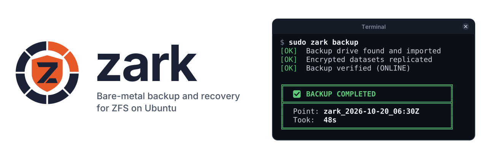
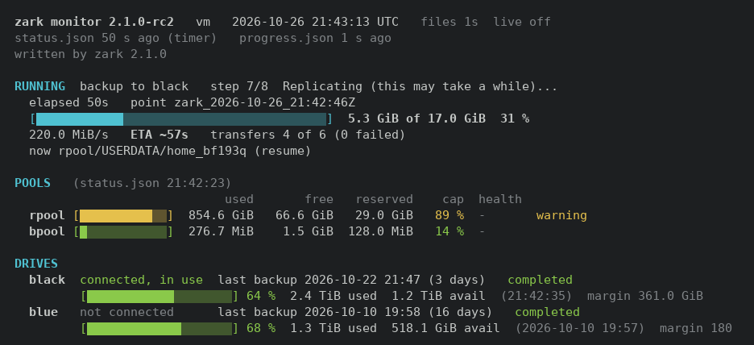
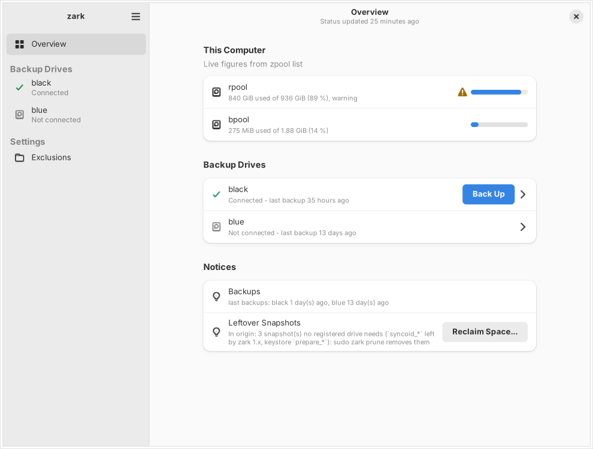
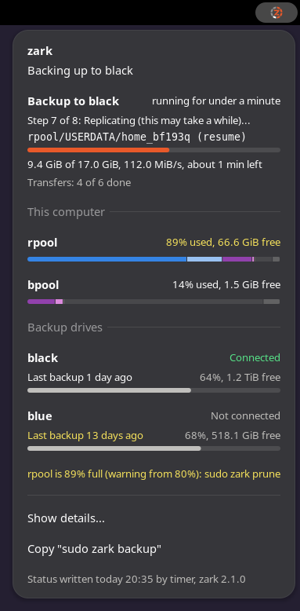

<p align="center">
  <picture>
    <source media="(prefers-color-scheme: dark)" srcset="docs/images/brand/zark-header-dark.svg">
    
  </picture>
</p>

# zark

**Bare-metal backup and recovery for Ubuntu on encrypted ZFS.**

[](https://github.com/juanmitaboada/zark/actions/workflows/ci.yml) [](https://github.com/juanmitaboada/zark/releases/latest) [](https://launchpad.net/~juanmitaboada/+archive/ubuntu/zark) [](LICENSE) [](https://sonarcloud.io/summary/new_code?id=juanmitaboada_zark) [](https://sonarcloud.io/summary/overall?id=juanmitaboada_zark) [](https://sonarcloud.io/summary/overall?id=juanmitaboada_zark)

Ubuntu's installer can put the whole system on ZFS with native encryption, and ZFS brings snapshots, checksums and encryption with it. What it does not bring is a way back when the disk dies. zark is that way back:

- `sudo zark backup` copies the system to an external drive, encrypted as it is, and adds a restore point each time;
- `sudo zark recover`, from an Ubuntu live USB, rebuilds the system on a new disk, still encrypted, and it boots with Secure Boot on the stock Ubuntu boot chain.

zark is for Ubuntu 24.04 LTS and 26.04 LTS, installed with the installer's encrypted ZFS layout (rpool, bpool and the keystore), and for Ubuntu 26.10, whose installer puts `/boot` on ext4 (rpool and the keystore, no bpool), with Secure Boot on. It is free software under the Apache License 2.0.

<p align="center">
  
  <br>
  <em><code>zark monitor</code> following a backup, as any user (example data).</em>
</p>

## Why ZFS, and what was missing

A ZFS snapshot is an instant, read-only copy of a dataset that costs nothing until data changes. Every block carries a checksum, so silent corruption is found, not copied. Encryption is part of the file system, and `zfs send` can move an encrypted dataset without ever decrypting it.

That is everything a backup needs, but not a backup by itself: snapshots live on the same disk as the data. Getting an encrypted ZFS root back onto a new disk means the partitions, the pools and `/boot`, the keystore, the EFI partition, the initramfs and a signed GRUB chain, all in agreement. One step out of place and the machine stops at an emergency shell. zark does those steps, in order, and checks them.

## Why zark

- **Bare-metal recovery** from a live USB: zark partitions the new disk, creates the pools with the features the old ones had, restores every dataset, the boot pool or the ext4 `/boot`, the keystore and the EFI binaries, and leaves a system that boots. The steps around the transfer take about a minute; the rest is copying your data.
- **The stock Ubuntu boot chain**: the signed shim and GRUB from Ubuntu's packages, the system's own initramfs. No custom binaries or patched configuration, so the recovered system takes `apt upgrade` like a fresh install.
- **Encrypted end to end**: backups are raw `zfs send` streams, so the drive holds ciphertext and the keys never travel in the clear.
- **A history on every drive**: each backup adds a restore point. After each complete backup the drive keeps every snapshot of its window (the last 30 days by default) and, before that, the newest point of each month, with no limit in time; the window is set per drive, and when space runs short zark lists the oldest monthly points and removes them only if you say yes ([retention](docs/RETENTION.md#retention-on-the-drive)). Each drive is anchored by its own ZFS bookmarks, so drives can rotate and stay unplugged for months.
- **Checked, not assumed**: every backup is read back from the drive before zark says it is safe to unplug, and `zark selftest` checks that this machine's ZFS, kernel and tools behave the way zark relies on.
- **Portable**: the same zark runs installed from a package or from its release tarball, which a live session extracts from a USB stick into memory.

## Quick start

Once per system, with a blank backup drive connected:

```bash
sudo zark setup      # snapshot policy (sanoid), guards, status alerts
sudo zark prepare /dev/disk/by-id/<disk>  # turn the blank drive into a registered backup drive
```

`ls -l /dev/disk/by-id/` names the drive (a USB drive's name starts with `usb-`); `prepare` refuses a disk that is not empty (`sudo zark purge <device>` empties one).

On Ubuntu 26.10, `setup` also asks to create `rpool/ROOT/<be>/zark-boot`, a copy of `/boot` that every backup refreshes before its point; `backup` and `prepare` refuse until it exists.

Then, whenever the drive is connected:

```bash
sudo zark backup     # one new restore point, incremental, verified
sudo zark status     # how full the pools are and how old each drive's last backup is
```

When the disk dies: boot an Ubuntu live USB with the drive connected, extract zark's portable tarball into `/tmp` ([below](#portable-tarball-required-for-live-usb-recovery)), and from `/tmp/zark`:

```bash
sudo ./zark recover  # rebuild the system on the new disk
```

Reboot into the recovered system and finish there:

```bash
sudo zark finish     # rebuild the initrds and grub.cfg, and check the boot chain
```

Every command, every question it asks and what it does: [docs/USAGE.md](docs/USAGE.md).

## Installation

zark ships in three complementary forms; **all three are first-class** and serve different use cases.

### Apt via PPA (recommended for productive systems)

For machines where zark drives the day-to-day backup routine:

```bash
sudo add-apt-repository ppa:juanmitaboada/zark
sudo apt update
sudo apt install zark
```

Supported series: noble (24.04 LTS), resolute (26.04 LTS), stonking (26.10). The package installs zark under `/usr/share/zark/`, exposes it as `/usr/bin/zark`,
and creates `/etc/zark/` for `known_drives.json`. Logs go to `/var/log/zark.log`.

### Standalone .deb download (when PPA isn't an option)

If you cannot or prefer not to add a PPA - restricted networks, offline systems, or simply a one-shot install - every release ships a prebuilt `.deb` as a release asset on GitHub:

```bash
wget https://github.com/juanmitaboada/zark/releases/latest/download/zark_<VERSION>-1_amd64.deb
sudo apt install ./zark_*.deb
```

Built from the same source and with the same layout as the PPA's packages, but versioned `<VERSION>-1`: the PPA's carry a series suffix (`~ubuntu24.04.1`, `~ubuntu26.04.1`) and sort below it, so on a machine with the PPA, install with apt. Updates are manual: re-download when a new release is announced.

### Portable tarball (required for live-USB recovery)

For disaster recovery from a live USB - when there is no installed system to `apt install` into - head to the [**Releases page**](https://github.com/juanmitaboada/zark/releases/latest) and
download the `zark_X.Y.Z.tar.gz` asset attached to the latest release. Then:

Keep it on a USB stick as it is. In the live session, extract it into `/tmp`, which is in memory there, and run zark from it:

```bash
tar xzf <the stick's folder>/zark_*.tar.gz -C /tmp
cd /tmp/zark
sudo ./zark recover
```

Do not extract it on the stick: on a FAT stick, as most are, the desktop mounts it with no execute bit for its files, and `./zark` does not run there. The stick's folder is `/run/media/<user>/<label>` on Ubuntu 26.10 and `/media/<user>/<label>` on earlier releases; Tab completion finds it.

On an installed system the tarball runs from any directory (`/opt`, `~/bin`) without installation. In a live session zark writes its log to `zark.log` next to the script instead of `/var/log/`: `/tmp/zark/zark.log` here, in memory and gone at the next boot. To keep it, copy it to the stick before rebooting: `sudo cp /tmp/zark/zark.log <the stick's folder>/`.

> **Why three?** The `.deb` package (PPA or direct) does not help much during recovery because the live session does not have zark installed, and installing it there needs a network and is lost at the next boot.
> The portable tarball is the way that needs neither. The PPA is the most ergonomic for routine backups (apt updates handle versioning), and the standalone `.deb` covers air-gapped or offline deployments where the PPA channel is impractical.

## Keeping an eye on it

- `sudo zark status` shows how full the pools are, how many days have passed since each drive's last backup, and what `zark prune` could free.
- `zark monitor`, in another terminal and as any user, follows a running command: its step, the bytes sent, the rate and the time left, and when zark waits for an answer. Below that, the pools and the drives.
- `zark setup` installs a login message and an hourly check: they warn when a pool is 80 % full or more (with a desktop notification from 90 %) and say how many days have passed since each drive's last backup.
- zark writes what it is doing and how the backups stand to two JSON files that any program can read without root: [docs/STATUS-FILES.md](docs/STATUS-FILES.md).

## On the desktop

### GNOME app

<p align="center">
  
</p>

[zark for GNOME](https://github.com/juanmitaboada/zark-gnome-app) shows how your backups stand in a window: how full the system pools are, each backup drive with its last backup, its space and its backup points, the datasets left out of backups, and a running backup's progress. It also runs zark's operations (back up, reclaim space, prepare, check, erase or register a drive, exclusions, retention): each one is a zark command run through `pkexec`, with the administrator's password, in a terminal inside the window where zark asks its questions as usual.

It needs Ubuntu 24.04 LTS, 26.04 LTS or 26.10 with GNOME, and zark 2.3.0 or later:

```bash
sudo apt install zark-gnome-app   # from the same PPA; brings zark along
```

### GNOME Shell extension

<p align="center">
  
</p>

[zark backup status](https://github.com/juanmitaboada/zark-gnome-extension) shows the same from the GNOME top bar: the last backup to each drive, a running backup's progress, when zark waits for an answer in its terminal, and how full the pools are. It notifies an overdue backup and a backup drive plugged in. It is read-only: it never starts or changes anything.

It needs Ubuntu 26.04 LTS (GNOME Shell 50) or 26.10 (GNOME Shell 51), and zark 2.1.0 or later (2.2.0 or later on 26.10):

```bash
sudo apt install gnome-shell-extension-zark   # from the same PPA; brings zark along
```

It has been submitted to [extensions.gnome.org](https://extensions.gnome.org/extension/11491/zark-backup-status/) and is awaiting review there; until it is approved, the PPA is the way to install it.

## How it compares

zark does one job: getting an Ubuntu system on encrypted ZFS back onto a new disk, bootable. Other good tools do neighbouring jobs, and some work well next to it.

| Tool | What it keeps | Rebuilds a bootable system on a new disk |
|---|---|---|
| [sanoid / syncoid](https://github.com/jimsalterjrs/sanoid) | ZFS snapshots on a schedule (sanoid) and their replication with `zfs send` (syncoid) | No, it replicates datasets. zark uses sanoid for the snapshots in the source |
| [zrepl](https://zrepl.github.io/) | ZFS replication, with raw sends of encrypted datasets | No, it replicates datasets |
| [Timeshift](https://github.com/linuxmint/timeshift) | System files, with rsync or Btrfs snapshots; home directories excluded by default | Restores a snapshot from a live session and reinstalls the bootloader; no ZFS mode |
| [restic](https://restic.net/), [Borg](https://www.borgbackup.org/) | Files and directories, deduplicated, with client-side encryption | No, they restore files |
| [Clonezilla](https://clonezilla.org/) | Whole partitions or disks, as images | Yes, from an image taken offline; ZFS is not among partclone's file systems |
| zark | Every dataset of the ZFS root, as raw `zfs send` streams, one restore point per backup, while the system runs | Yes, from an Ubuntu live USB, with Secure Boot |

## Proof

- **Tested on hardware for every 2.x release**, on a Dell XPS 13 9333 with the installer's encrypted ZFS layout: setup, the self-test, prepare, backups, exclusions, prune, and a recover from an Ubuntu live USB followed by finish and a boot. Which Ubuntu series each release was tested on, and what was tested on each, is in its entry in [CHANGELOG.md](CHANGELOG.md).
- **In daily use**: the maintainer has backed up his own laptop with zark since May 2026, and with 2.0 since its release.
- **Self-test certificates**: each release ships the results of `zark selftest` on the maintainer's test machine in [`certificates/`](certificates/), shown by Ubuntu series, kernel and OpenZFS on the [certificates matrix](https://juanmitaboada.github.io/zark/); `zark selftest status` tells whether they cover your kernel and OpenZFS, and `zark selftest report` prints a link to share yours.
- **Tests**: the unit suite covers every command and module on a model of ZFS and runs on Python 3.12, 3.13 and 3.14 with ruff, pylint, mypy and basedpyright: [docs/TESTING.md](docs/TESTING.md).
- **History**: every change, and the alternatives that were rejected, in [CHANGELOG.md](CHANGELOG.md).

## What zark touches

zark performs **destructive operations** on ZFS pools and disk devices, including pool destruction, dataset rollback, partition table rewriting, and boot chain modification.

- **You can lose all data** on the target drives if you misidentify a device.
- **You can render your system unbootable** if recovery is interrupted or misconfigured.
- Always test on **non-production hardware** first.
- Always keep **at least one independent backup** outside of zark's control.
- The authors assume no responsibility for data loss, hardware damage, or system downtime resulting from the use of this tool.

This software is provided "as is", without warranty of any kind, as detailed in the [Apache License 2.0](LICENSE). The [security notes](docs/DESIGN.md#security-notes) say what zark does with passphrases and keys.

## Documentation

- [Usage](docs/USAGE.md): the commands, a first backup, a recovery, requirements and the drive registry.
- [Upgrading zark](docs/UPGRADING.md) (from 2.0, and from 1.x), and upgrading Ubuntu from 24.04 to 26.04 with zark.
- [Design](docs/DESIGN.md): architecture, key decisions, compatibility and security notes.
- [Drive rotation and retention](docs/RETENTION.md).
- [Safe USB disconnect](docs/SAFE-DISCONNECT.md) and [hardware notes](docs/HARDWARE.md).
- [Status files for other programs](docs/STATUS-FILES.md).
- [Testing](docs/TESTING.md).
- [Troubleshooting and FAQ](docs/TROUBLESHOOTING.md).
- The manpage, `man zark`, once the package is installed.

## License

zark is licensed under the [Apache License, Version 2.0](LICENSE).

- Full license text: [`LICENSE`](LICENSE)
- Attribution requirements (propagated by redistributors): [`NOTICE`](NOTICE)

Apache 2.0 includes an explicit patent grant from contributors to users and an "AS IS" disclaimer of warranties. See sections 3 (Grant of Patent License), 7 (Disclaimer of Warranty), and 8 (Limitation of Liability) of the license text for the legal specifics.

---

zark is written and maintained by [Juanmi Taboada](https://www.juanmitaboada.com).
